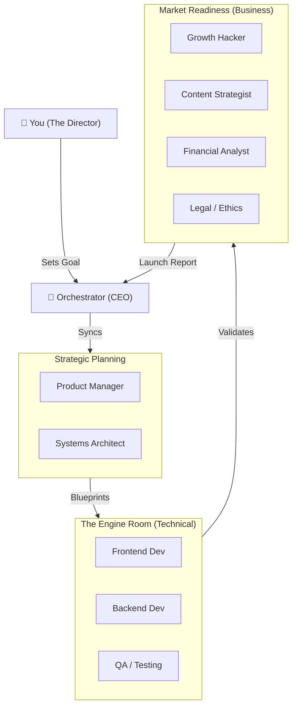

# JESHAI: Your Local-First AI Company Orchestrator

**"The Future of Business is Local, Private, and Autonomous."**

JESHAI is a professional AI-driven workspace that transforms a single computer into a high-performance **Full-Stack Technology Company**. It orchestrates 12 specialized AI agents—spanning Engineering, Product, Marketing, and Legal—allowing you to build, audit, and launch projects with total data privacy.

---

## 🏛️ The Company Organogram (How it Works)

JESHAI isn't just a chatbot; it's a **Digital Workforce**. Here is how the team collaborates to turn your ideas into reality:



---

## 💡 How JESHAI Changes the Game (Use Cases)

JESHAI is designed for three distinct "Modes" of operation:

### 🚀 1. The Autonomous Dev-Loop (For Builders)
*   **Plain English**: You give an idea, and JESHAI builds the code, runs tests, and fixes bugs until the app works.
*   **The Tech**: Uses sequential agent handoffs to keep memory usage low while ensuring elite code quality.

### 🏗️ 2. Project Onboarding (For Legacy Projects)
*   **Plain English**: Have an unfinished or buggy project? JESHAI audits it, identifies the errors, and finishes the work for you.
*   **The Tech**: Leverages the **QA** and **Auditor** agents to map and refactor legacy codebases autonomously.

### 📈 3. The Business Launchpad (For Entrepreneurs)
*   **Plain English**: Once your app is built, JESHAI’s **Marketing** and **Finance** agents create your launch strategy, ad copy, and ROI reports.
*   **The Tech**: Orchestrates **Growth Hacker** and **Content Strategist** agents to handle the full marketing lifecycle.

---

## 🛡️ Why Investors Choose JESHAI

### 🔐 Total Data Sovereignty
In an industry where data is the new oil, JESHAI ensures your "oil" never leaves your machine. By running locally via **Ollama**, JESHAI protects your IP, trade secrets, and financial data from third-party AI providers.

### ⚙️ Full-Lifecycle Autonomy
JESHAI is the only local-first system that handles the **Entire Business Stack**. It doesn't just write code; it plans, audits, markets, and ensures compliance—all in one place.

---

## 🚀 Getting Started

### 1. Simple Installation
*   **Dependencies**: Ensure [Ollama](https://ollama.com) and [Node.js](https://nodejs.org) are installed.
*   **Setup**:
    ```bash
    git clone https://github.com/Jeshrum/jeshai.git
    cd jeshai
    npm install
    ```

### 2. Launching The Machine
Simply state your goal, and let the agents assemble:
```bash
npm start -- "Build a secure local vault for my passwords"
```

---
*JESHAI: Local Intelligence, Globally Capable. Built for the Sovereign Entrepreneur.*
