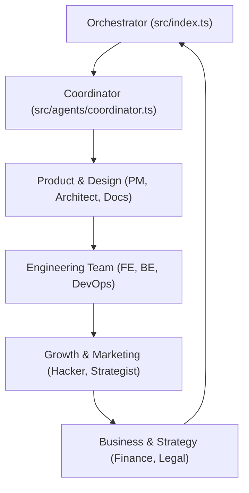

# JESHAI: The World's First Local-First AI Company Orchestrator

**Local Intelligence. Global Capability. Total Data Sovereignty.**

JESHAI is a professional-grade, multi-agent AI workspace designed to operate as a self-contained, full-stack technology company. Powered by **Ollama**, JESHAI orchestrates a team of 12 specialized AI agents—spanning Engineering, Product, Marketing, Finance, and Legal—all running autonomously on local hardware.

---

## 💎 The JESHAI Value Proposition

In an era of cloud-dependency and data leakage, JESHAI provides a secure, private, and high-performance alternative for building and launching technology products.

### 🛡️ 100% Data Sovereignty
Commercial secrets, proprietary code, and financial strategies never leave your local machine. JESHAI uses local LLMs to ensure your company's intellectual property is yours alone.

### ⚡ Professional Autonomy
JESHAI agents aren't just chat bots—they are **Functional Specialists**. With built-in skills for **Terminal Execution**, **File System Modification**, and **Sequential Context Handoffs**, the system can audit code, fix bugs, and draft marketing material without human intervention.

---

## 🏢 The Team (12 Specialized Roles)

JESHAI simulates the department structure of a modern tech firm:



| Department | Core Focus |
| :--- | :--- |
| **Engineering** | Code generation, security auditing, and automated testing. |
| **Product** | Requirement alignment, system architecture, and user-centric logic. |
| **Marketing** | Viral growth loops, brand voice, and video content synthesis. |
| **Strategy** | ROI analysis, budget tracking, and legal/privacy compliance. |

---

## 🪜 Operational Workflows

JESHAI is powered by three "Elite" workflows designed for different stages of the product lifecycle:

### 1. The Dev-Loop (Innovation Mode)
Rapidly prototype and build new features. The **Architect** plans, **Engineers** build, and **QA** verifies the code via local terminal execution.

### 2. Project Onboarding (Revival Mode)
Inherit existing legacy codebases. JESHAI audits the current state, identifies bugs, and completes the unfinished vision autonomously.

### 3. Business Launch (Growth Mode)
Transform code into a product. The **Growth Hacker** and **Content Strategist** create market-ready assets while the **Financial Analyst** verifies ROI.

---

## 🚀 Getting Started

### Installation (Professional Setup)
1.  **Clone the Vision**: `git clone https://github.com/Jeshrum/jeshai.git`
2.  **Install Engine**: `npm install`
3.  **Power On**: Ensure [Ollama](https://ollama.com) is running locally with your preferred models (e.g., `qwen2.5-coder`).

### Usage
Run the engine with a high-level objective:
```bash
npm start -- "Audit and finish my existing React dashboard in ./my-project"
```

---

## 🛠️ Technical Stack
- **AI Engine**: Ollama (Local LLM Orchestration)
- **Orchestration**: Vercel AI SDK
- **Language**: TypeScript (Node.js)
- **Governance**: Custom Guarded Write Blocks & Terminal Execution Safety.

---
*JESHAI: Secure, Autonomous, and Invested in Your Growth.*
