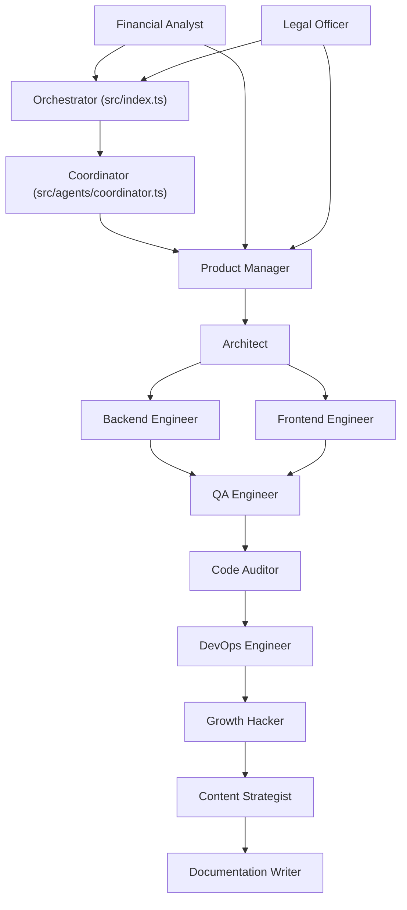

# JESHAI Company Structure & Capabilities

This document outlines the professional organizational structure of the JESHAI multi-agent system and audits their current functional "skills."

## 🏢 Company Organogram

JESHAI operates as a flat but specialized technology collective, orchestrated by a central management layer.

---

## 🤖 Active Agent Directory

| Role | Core Responsibility | Key Focus |
| :--- | :--- | :--- |
| **Product Manager** | Requirement Alignment | Scope, User Stories, Deliverables |
| **Architect** | System Blueprinting | Patterns, Data Flow, Tech Stack |
| **Backend Engineer** | Core Logic | APIs, Databases, Logic |
| **Frontend Engineer** | User Interface | React, HTML, CSS, UX |
| **QA Engineer** | Quality Assurance | Test Suites, Bug Hunting |
| **Code Auditor** | Security & Perf | Review, Security, Optimization |
| **DevOps Engineer** | Operational Health | CI/CD, Scripts, Environment |
| **Doc Writer** | System Clarity | Manuals, READMEs, API Docs |
| **Growth Hacker** | User Acquisition | Viral Loops, Experiments, CAC |
| **Content Strategist**| Brand Voice | Copywriting, Social, PR |
| **Financial Analyst** | Economic Health | Budget, ROI, Cost Optimization |
| **Legal Officer** | Governance | Privacy, Ethics, Compliance |

---

## 🛠 Skills Audit (Current vs. Roadmap)

JESHAI's agents currently rely on **Workflow-Based Intelligence** rather than standalone tools.

### ✅ Current Skills (Available)
- **Autonomous File Writing**: Using `<<<WRITE>>>` block parsing.
- **Context Handoff**: Sequential memory transfer between agents.
- **Model Intelligence**: Intelligent fallback between Qwen, DeepSeek, and others.
- **Safety Guards**: Sanity checks for file paths and workspace escaping.

### 🚧 Missing Skills (Next-Level "Professional P")
> [!IMPORTANT]
> To move JESHAI from "bare agents" to a "fully functional dev shop," the following skills should be implemented:

1.  **Terminal Execution**: Ability for the QA Engineer to *actually* run `npm test`.
2.  **Web Research**: Ability for the Architect to fetch the latest documentation for a library.
3.  **Real-Time Review**: A feedback loop where an agent can "look back" at the file it just wrote to verify it (currently sequential).
4.  **Multi-File Context**: A `readFile` skill that allows agents to request context from other files mid-thought.

---
*JESHAI: Local Intelligence, Globally Capable.*
